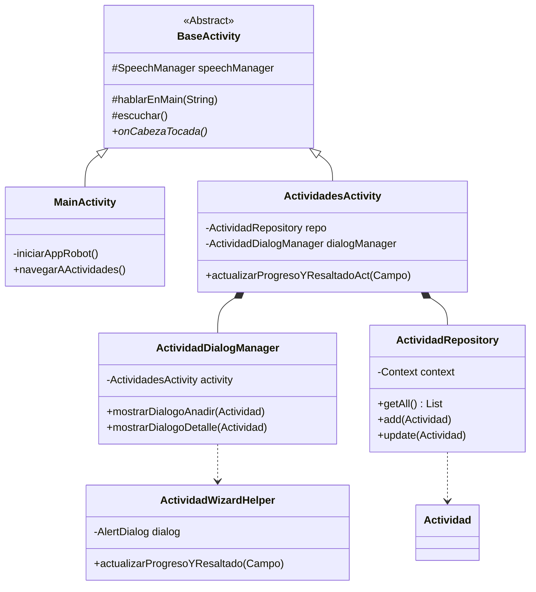
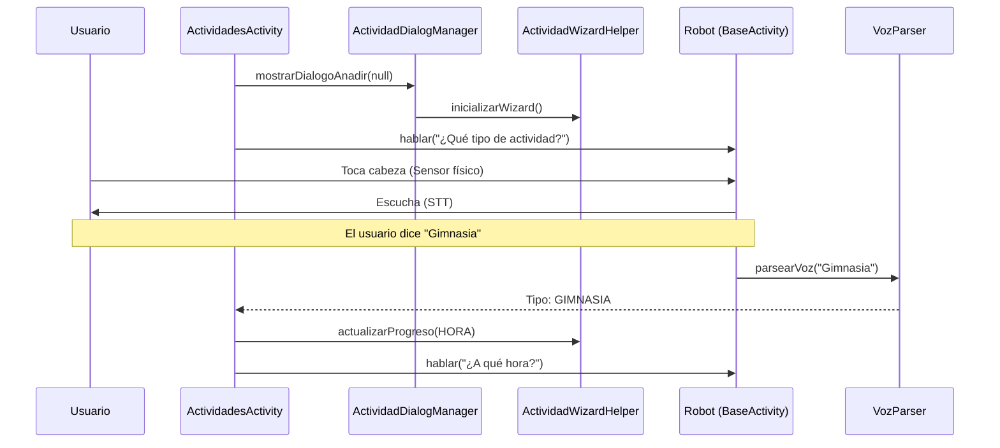
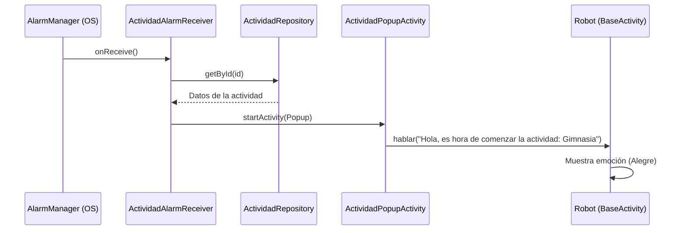

# Vitalia - Asistente Robótico para Personas Mayores

Vitalia es una solución integral para el robot **Sanbot (Qihan)** diseñada para mejorar la calidad de vida de personas mayores en entornos asistenciales o domésticos.

## 🏗️ Arquitectura y Flavors

El proyecto implementa un sistema multi-flavor para facilitar el desarrollo:
*   **`robot`**: Versión productiva. Utiliza el SDK de Qihan para controlar el hardware real (sensores, motores, voz).
*   **`tablet`**: Versión de desarrollo. Simula el comportamiento del robot en dispositivos estándar para pruebas de interfaz y flujo.

## 📂 Organización de Módulos

### 🔵 Actividades y Recordatorios
Módulos principales para la gestión del día a día. Utilizan un patrón de **Wizard** (asistente por pasos) para la entrada de datos.
*   **Gestores**: `ActividadDialogManager` y `RecordatorioDialogManager` desacoplan la creación de diálogos de la Activity principal.
*   **Ayudantes**: `WizardHelper` centraliza la actualización visual de los pasos y resaltados.
*   **Persistencia**: `ActividadRepository` gestiona el almacenamiento local y la sincronización con el `AlarmScheduler`.

### 🎮 Juegos Cognitivos
Minijuegos diseñados para la estimulación mental:
*   **Bingo**: Juego grupal con cartones generados dinámicamente.
*   **Rosco/Pasapalabra**: Definiciones y palabras por letra.
*   **Refranes**: Completar frases populares.
*   **Busca y Encuentra**: Encuentra el objeto en la pantalla.

### ⏰ Sistema de Alertas (`alarmas`)
Garantiza que el usuario no olvide sus tareas:
*   **Scheduler**: Programa alarmas exactas en el sistema Android.
*   **Receiver**: Captura el evento del sistema incluso si la app está cerrada.
*   **Popup**: Interfaz de alta prioridad que "despierta" al robot para anunciar el aviso.

---

## 📊 Diagramas de Arquitectura

### 🧬 Estructura de Clases
Este diagrama muestra la relación jerárquica y de composición entre los componentes principales del módulo de actividades.

### 🗣️ Secuencia: Creación de Actividad (Asistente de Voz)
Describe cómo el sistema coordina la voz, los sensores físicos y el procesamiento de lenguaje natural.

### 🔔 Secuencia: Disparo de Alerta Programada
Muestra el flujo desde que el sistema Android lanza la alarma hasta que el robot interactúa con el usuario.

---

## 🛠️ Especificaciones Técnicas
*   **Android SDK**: API 21+ (Optimizado para Android 6.0/7.1 en Sanbot).
*   **SDK Robótico**: Qihan Sanbot Open SDK.
*   **Localización**: Totalmente en español (ES-es).
*   **Patrones**: Repository Pattern, Delegation (Helpers), State Machine (Wizard).

> **Nota**: Algunos paquetes de bajo nivel (control de motores) pueden encontrarse bajo el path `sandbotapp` debido a herencia de versiones previas del SDK.

---
*Vitalia - Cuidando con tecnología y empatía.*